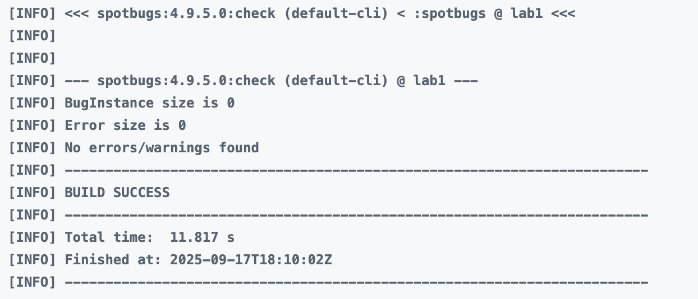
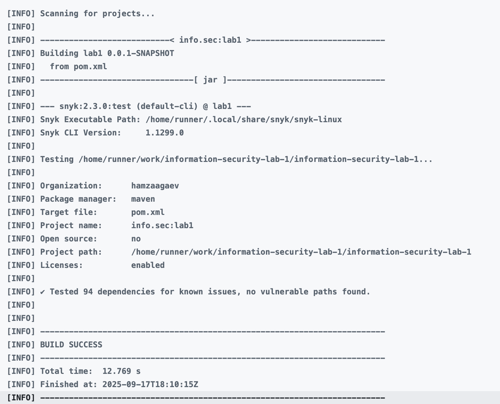

# Лабораторная работа №1

В данной лабораторной работе было разработано REST API с авторизацией и доступом по JWT-токенам, позволяющее пользователям считать численные примеры как на калькуляторе и смотреть историю примеров, которые решались.

## Список эндпоинтов
По умолчанию приложение запускается на порту 8080.

### Авторизоваться через логин и пароль
Аутентифицирует пользователя и возвращает пару JWT-токенов.

**Формат запроса**
```
POST /auth/login -d '{"username": "some_user", "password": "some_password"}'
```

**Формат ответа**
```
200 OK

{
    "accessToken": "<JWT>",
    "refreshToken": "<JWT>"
}
```

### Зарегистрировать нового пользователя
Создает новую учетную запись в системе.

**Формат запроса**
```
POST /auth/register -d '{"username": "some_user", "password": "some_password"}'
```

**Формат ответа**
```
200 OK
```

### Обновить JWT токены пользователя
Использует refresh token для получения новой пары access/refresh токенов.

**Формат запроса**
```
POST /auth/refresh-token -d '{"refreshToken": "<JWT>"}'
```

**Формат ответа**
```
200 OK

{
    "accessToken": "<JWT>",
    "refreshToken": "<JWT>"
}
```

### Посчитать числовой пример
Принимает строку с математическим выражением, вычисляет его и сохраняет результат в список пользователя.

**Формат запроса**
```
POST /api/calculate -d '{"expression": "2+2*2"}'
```

**Формат ответа**
```
200 OK

6.0
```

### Получить историю примеров
Возвращает список всех выражений, которые вычислил текущий аутентифицированный пользователь, и их результаты.

**Формат запроса**
```
GET /api/data
```

**Формат ответа**
```
200 OK

[
    {
        "expression": "2+2*2",
        "result": 6.0
    },
    {
        "expression": "128/2+22",
        "result": 86.0
    }
]
```

## Подробное описание реализованных мер защиты

### Защита от SQL-инъекций
Защита от SQL-инъекций обеспечивается при использовании Spring Data JPA, который работает поверх такого фреймворка, как Hibernate. Он в свою очередь использует параметризованные запросы для обращения к БД (запросы генерируются автоматически, так как Hibernate реализует спецификацию JPA).

### Защита от XSS-атак
Для того, чтобы обеспечить защиту от XSS-атак, как минимум нужно, чтобы REST API возвращало экранированные символы из любых данных в базе. Именно это и было реализовано с помощью сериализатора в JSON [тут](src/main/java/info/sec/lab1/configuration/XssStringSerializer.java) и [здесь](src/main/java/info/sec/lab1/configuration/XssStringSerializer.java) с помощью конфигурации библиотеки Jackson, которая используется в Spring Boot для работы с JSON.

### Реализация аутентификации пользователя
Аутентификация пользователя реализована в [этой директории](src/main/java/info/sec/lab1/authentication).

В работе используются JWT токены access и refresh. Access токен используется непосредственно для доступа к защищенным эндпоинтам, по нему и происходит определение пользователя, а refresh токен используется для обновления access и refresh токенов, поскольку access токен имеет небольшое время использования (15 минут). Refresh токен можно использовать 30 дней.

Для JWT токенов используются подписи с алгоритмом HS256, хранится их время истечения (expiresIn).

JWT токены можно получить при авторизации в `/auth/login`, а обновить в `/auth/refresh-token` используя refresh.

На защищенных эндпоинтах стоит фильтр запросов, который проверяет наличие и валидность access JWT-токена в заголовке "Authorization".

В базе данных все пароли хранятся в зашифрованном виде, для этого используется bcrypt.

## Полученные отчеты по SAST/SCA из "Actions"
Отчет из spotbugs.


Отчет из Snyk.
